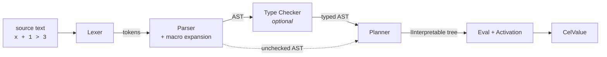
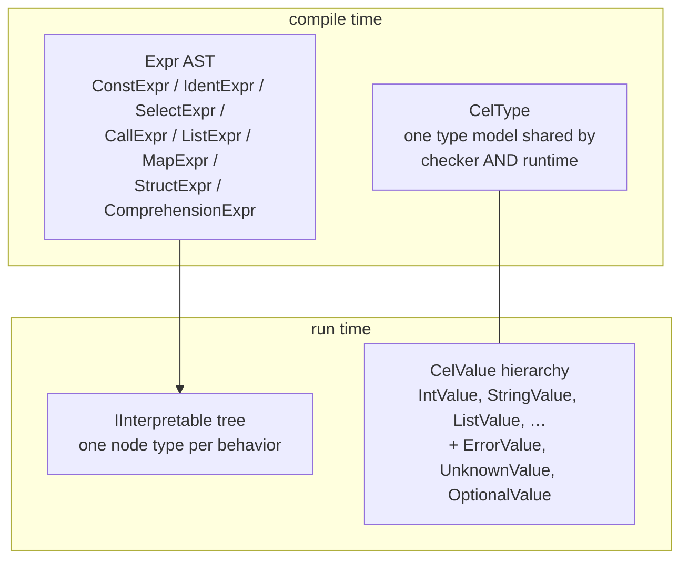

# Architecture Overview

This section is a guided tour of how Celly actually works, written to be read in order.
Every stage links to the source file that implements it.

## The pipeline

A CEL expression goes through four stages:



| Stage | Source | Job |
|---|---|---|
| Lexer | `src/Celly/Parsing/Lexer.cs` | text → tokens (strings, numbers, operators) |
| Parser | `src/Celly/Parsing/Parser.cs` | tokens → AST; expands macros as it goes |
| Checker | `src/Celly/Checking/Checker.cs` | annotates every AST node with a type; rejects bad programs |
| Planner | `src/Celly/Interpreter/Planner.cs` | AST → tree of `IInterpretable` objects |
| Eval | `src/Celly/Interpreter/Interpretables.cs` | walks the interpretable tree against an activation |

Two properties shape everything:

1. **The checker is optional** (gradual typing). Evaluation must work on unchecked ASTs
   where every type is `dyn` — so the runtime carries full type information in its values
   and does its own dispatch.
2. **Errors are values**, not exceptions. `ErrorValue`/`UnknownValue` flow through
   evaluation, which is what makes CEL's
   [commutative error absorption](../guide/errors.md) expressible.

## The cast of data structures



- **`Expr`** (`src/Celly/Ast/Expr.cs`) mirrors the canonical `cel.expr.Expr` proto shape —
  eight node kinds, each with a parse-unique id used by source positions and type maps.
- **`CelType`** (`src/Celly/Types/CelType.cs`) is a single type model used both by the
  checker (parameterized: `list(int)`, type params) and at runtime (`type(x)` yields one).
  Primitives are singletons so `type(1) == int` is structural.
- **`CelValue`** (`src/Celly/Values/`) is the runtime value hierarchy; capability
  interfaces (`IAdder`, `IComparableValue`, `IIndexerValue`, …) drive operator dispatch.
- **`IInterpretable`** is the compiled form: `Eval(IActivation) → CelValue`, one class per
  behavior (constant, ident lookup, call, logical-and, comprehension, …).

## The extension seams

Two seams keep the core dependency-free while letting features plug in:

```mermaid
flowchart LR
    subgraph Celly core — zero deps
        ENV[CelEnv] --> P[Planner]
        ENV --> C[Checker]
        P & C --> SEAM([ITypeProvider / ITypeAdapter])
        ENV --> LIB([CelLibrary])
    end
    PROTO[Celly.Protobuf<br/>ProtoTypeRegistry] -.implements.-> SEAM
    EXT[Extensions<br/>strings, math, optionals, …] -.registers into.-> LIB
```

- **`ITypeProvider` / `ITypeAdapter`** (`src/Celly/Providers/`): struct construction,
  field types, enum constants, native-value adaption. `Celly.Protobuf`'s
  `ProtoTypeRegistry` implements both; the core ships a `NativeTypeAdapter` for plain .NET
  values. This is the *only* door protobuf enters through.
- **`CelLibrary`** (`src/Celly/CelLibrary.cs`): an extension = macros (parse time) +
  function implementations (run time) + declarations (check time), registered as one unit.
  All nine extension libraries — and even the strong-enum mode — are just `CelLibrary`
  instances.

## Reading order

1. [Lexer & Parser](parser.md) — how text becomes an AST without a parser generator
2. [Macros](macros.md) — how `all()`/`exists()` become loops without loops
3. [The Value Model](values.md) — runtime values and the sharp edges of CEL numerics
4. [Type Checker](checker.md) — unification, gradual typing, name resolution
5. [Planner & Evaluator](evaluator.md) — how evaluation actually executes
6. [Protobuf Integration](protobuf.md) — messages, well-known types, Any
7. [Conformance Testing](conformance.md) — how 100% is measured and kept
